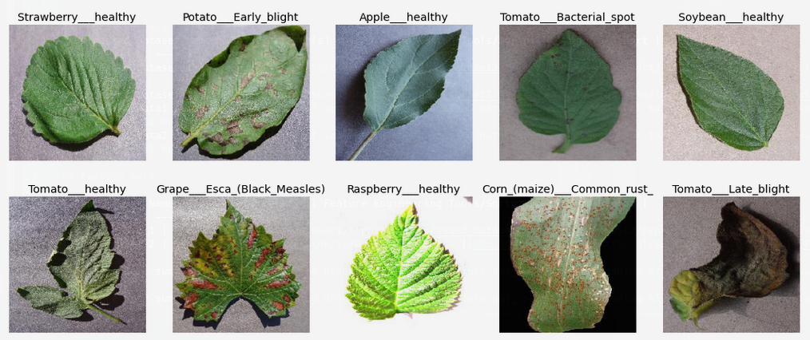

# Data Report

This document contains the results from the exploratory data analysis.

## General summary of the data

## Data quality summary

The dataset is mostly compounded of single samples of leaves photos in different lightning conditions and ussualy over a white background.

## Target variable

## Individual variables

## Variable ranking

## Relationship between explanatory variables and target variable

